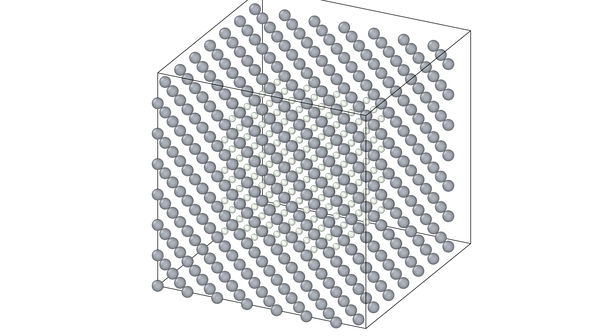

# Void Mapping & Connectivity Analysis: Bulk FCC Nickel

This example demonstrates how to identify and map the ideal interstitial network in a **pristine Bulk FCC Nickel** lattice. While the sites in bulk are geometrically perfect, this script provides the necessary `voids_file` for bulk baseline simulations and validates the connectivity logic before moving to complex interfaces.



## 🔬 Algorithm Overview

The mapping process follows a standardized geometric pipeline to identify stable interstitial pockets in a perfect crystal:

### 1. Global Lattice Processing
Unlike Grain Boundary studies, the bulk mapping typically ignores spatial bounding boxes to capture the full periodic network.
* **Uniformity**: The algorithm identifies sites across the entire $8 \times 8 \times 8$ (or similar) supercell.
* **Symmetry**: In a perfect FCC lattice, this process captures the high-symmetry **Octahedral** sites (the "natural" centers of the FCC unit cell).

### 2. Voronoi Vertex Detection & Radius Filtering
The algorithm detects low-density regions using **Voronoi Tessellation**:
* **Vertices as Candidates**: In FCC, Voronoi vertices correspond to the geometric centers of interstitial holes.
* **Radius Threshold (`rmin`)**: For this Ni example, `rmin` is set to **1.54 Å**. This specific threshold is tuned to capture the larger **Octahedral sites** while effectively filtering out the smaller, less stable tetrahedral sites.

### 3. Hierarchical COM Collapse
Even in perfect crystals, numerical precision in Voronoi tessellation can create redundant vertices.
* **Agglomerative Clustering**: The script groups sub-angstrom vertex clusters into single nodes.
* **Center of Mass (COM)**: Each octahedral site is represented by exactly one "Void Marker," ensuring the Monte Carlo engine counts site occupancy correctly.

### 4. Network Connectivity Analysis
The script analyzes the "jump network" between octahedral sites.
* **Ideal Spacing**: In bulk FCC Ni, the nearest-neighbor distance between octahedral sites is approximately **2.49 Å** (corresponding to $a/\sqrt{2}$).
* **Dynamic Buffer**: A **0.5 Å** buffer is added to the average to define the connectivity shell, ensuring the sampler can jump between all adjacent sites.


---

## 📤 Output Files

Upon execution, the script generates:

1.  **`voids-POSCAR-bulk`**: Contains the identified octahedral void markers (represented as `H` atoms). 
2.  **`full_voids-POSCAR-bulk`**: A visualization file to verify that the markers sit perfectly at the center of the Ni-Ni-Ni-Ni-Ni-Ni octahedra.

---

## 📏 Determining the `jump_cutoff`

The script provides a console report to configure the `spectral` or `canonical` blocks in `config.yaml`. 

**The Bulk Connectivity Report:**
```text
=============================================
      VOID NETWORK CONNECTIVITY REPORT
=============================================
Total Voids Found:       256
Minimum NN Distance:     2.492 Å
Natural NN Average:      2.492 Å
Search Threshold:        2.992 Å
Average Edge Distance:   2.492 Å
MAX EDGE (Suggested):    2.492 Å
---------------------------------------------
RECOMMENDED jump_cutoff: 2.50 Å
=============================================